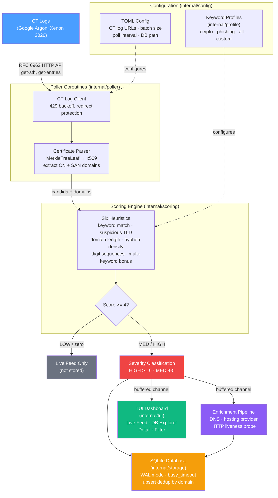

# ctsnare

[](https://github.com/ul0gic/ctsnare/actions/workflows/ci.yml)
[](https://go.dev/)
[](LICENSE)
[](https://github.com/ul0gic/ctsnare/releases)
[](https://goreportcard.com/report/github.com/ul0gic/ctsnare)

Monitor Certificate Transparency logs in real-time to detect phishing, typosquatting, and brand impersonation domains the moment their TLS certificates are issued.

ctsnare polls public CT logs directly (RFC 6962 API, no third-party relay), scores new domains against keyword profiles using six heuristics, enriches hits with DNS and HTTP liveness probes, stores actionable hits in an embedded SQLite database, and gives you a live terminal dashboard plus a composable CLI query interface — all in a single, zero-dependency binary.

---

## Features

- **Real-time CT log polling** — Direct RFC 6962 HTTP polling of Google Argon, Xenon, and other CT logs. No WebSocket relays, no accounts, no API keys.
- **Scoring engine** — Six heuristics score each domain: keyword density, suspicious TLD, domain length, hyphen count, digit sequences, and multi-keyword bonus. Only MED+ (score >= 4) hits are persisted — LOW-scored heuristic noise stays out of your database.
- **Enrichment pipeline** — Automatic DNS resolution, CIDR-based hosting provider detection, and HTTP HEAD liveness probes for every stored hit. See which domains are actually live.
- **Keyword profiles** — Built-in profiles for crypto scams and phishing. Define your own in TOML with keyword lists and TLD boost sets.
- **Persistent SQLite storage** — Actionable hits stored in WAL-mode SQLite. Crashes don't lose data. Deduplication by domain.
- **TUI dashboard** — Live feed view with pause control, DB explorer with bookmarks and batch delete, detail drill-down with enrichment data. Sort, filter, and manage hits without stopping polling.
- **CLI query interface** — Composable filters for scripting, piping, and ad hoc investigation. Filter by liveness, bookmarks, severity, keywords, TLD, and more.
- **Single binary** — One file, no runtime, no setup. `go install` or download from GitHub Releases.

---

## Installation

### go install (recommended)

```bash
go install github.com/ul0gic/ctsnare@latest
```

### Download binary

Pre-built binaries for Linux, macOS, and Windows are available on the [GitHub Releases](https://github.com/ul0gic/ctsnare/releases) page.

```bash
# Linux amd64 example
curl -L https://github.com/ul0gic/ctsnare/releases/latest/download/ctsnare_linux_amd64.tar.gz | tar xz
chmod +x ctsnare
sudo mv ctsnare /usr/local/bin/
```

### Build from source

Requires Go 1.26 or later.

```bash
git clone https://github.com/ul0gic/ctsnare.git
cd ctsnare
go build -o ctsnare ./cmd/ctsnare
```

---

## Quick Start

Start monitoring:

```bash
ctsnare watch
```

This opens the TUI dashboard, begins polling Google Argon and Xenon 2026 CT logs against the `all` profile (crypto + phishing keywords), and stores every MED+ scored hit in `~/.local/share/ctsnare/ctsnare.db`.

Press `Tab` to switch between the Live Feed and the DB Explorer. Press `p` to pause/resume the feed. Press `q` to quit.

### Headless mode (server / cron / background)

```bash
ctsnare watch --headless
```

Polls and stores without the TUI. Runs until SIGINT or SIGTERM.

### Backtrack for immediate results

```bash
# Start 5000 entries behind the log tip — processes recent history immediately
ctsnare watch --backtrack 5000
```

### Query stored hits

```bash
# Show the 50 most recent hits (table format)
ctsnare query

# Show only HIGH severity hits in JSON
ctsnare query --severity HIGH --format json

# All hits containing "casino" in the last 12 hours
ctsnare query --keyword casino --since 12h

# Only live domains (responded to HTTP probe)
ctsnare query --live-only

# Show bookmarked hits
ctsnare query --bookmarked

# Composable: HIGH crypto hits on suspicious TLDs, piped to jq
ctsnare query --keyword wallet --severity HIGH --since 24h --format json | jq '.domain'
```

---

## Subcommand Reference

### `ctsnare watch`

Start live CT log monitoring with the TUI dashboard or in headless mode.

```
ctsnare watch [flags]
```

| Flag | Default | Description |
|------|---------|-------------|
| `--profile` | `all` | Keyword profile to use for scoring (`crypto`, `phishing`, `all`, or a custom profile name) |
| `--session` | _(empty)_ | Tag all hits from this run with a session name for grouping and filtering later |
| `--headless` | `false` | Run without TUI — poll and store only, suitable for background processes |
| `--batch-size` | `256` | Number of CT log entries to fetch per poll request |
| `--poll-interval` | `5s` | How long to wait between polls per log (e.g., `1s`, `5s`, `30s`) |
| `--backtrack` | `0` | Start N entries behind the current log tip for immediate results |

Global flags available on all commands:

| Flag | Description |
|------|-------------|
| `--config` | Path to TOML config file |
| `--db` | Override the database path |
| `--verbose` | Enable debug logging to stderr (JSON format) |

**Examples:**

```bash
# Watch with crypto profile, tag hits as "morning-run"
ctsnare watch --profile crypto --session morning-run

# Headless monitoring with custom poll interval
ctsnare watch --headless --poll-interval 10s

# Fast polling with large batches
ctsnare watch --poll-interval 1s --batch-size 1024

# Backtrack for immediate results
ctsnare watch --backtrack 5000
```

**TUI keybindings:**

#### Feed view

| Key | Action |
|-----|--------|
| `Tab` | Switch to DB Explorer |
| `p` | Pause / resume feed |
| `j` / `k` | Scroll down / up |
| `q` | Quit |

#### Explorer view

| Key | Action |
|-----|--------|
| `Tab` | Switch to Live Feed |
| `Enter` | Drill into selected record |
| `f` | Open filter overlay |
| `s` | Cycle sort column and direction |
| `r` | Reload from database |
| `Space` | Toggle selection on current row |
| `a` | Select all visible |
| `A` | Deselect all |
| `b` | Toggle bookmark on current row |
| `d` | Delete current row (with confirmation) |
| `D` | Delete all selected rows (with confirmation) |
| `C` | Clear entire database (with confirmation) |
| `Esc` | Back / dismiss overlay |
| `q` | Quit |

---

### `ctsnare query`

Search and filter stored hits from the local database. Outputs to stdout.

```
ctsnare query [flags]
```

| Flag | Default | Description |
|------|---------|-------------|
| `--keyword` | _(none)_ | Filter hits where matched keywords contain this substring |
| `--score-min` | `0` | Only show hits with score at or above this threshold |
| `--severity` | _(none)_ | Filter by severity: `HIGH`, `MED`, or `LOW` |
| `--since` | _(none)_ | Only hits from this duration ago (e.g., `1h`, `24h`, `7d`) |
| `--tld` | _(none)_ | Filter by TLD suffix (e.g., `.xyz`, `top`) |
| `--session` | _(none)_ | Filter hits by session tag |
| `--live-only` | `false` | Show only domains that responded to HTTP liveness probe |
| `--bookmarked` | `false` | Show only bookmarked hits |
| `--format` | `table` | Output format: `table`, `json`, or `csv` |
| `--limit` | `50` | Maximum number of results to return |

**Examples:**

```bash
# Show all HIGH severity hits
ctsnare query --severity HIGH

# Recent phishing hits on suspicious TLDs
ctsnare query --keyword login --tld .xyz --since 6h

# Score 5 or higher, JSON output
ctsnare query --score-min 5 --format json

# Only live domains
ctsnare query --live-only --severity HIGH

# All hits from a named session, CSV for spreadsheet import
ctsnare query --session midnight-run --format csv > midnight-run.csv

# Composable filter for threat hunting
ctsnare query --keyword metamask --severity HIGH --since 24h --format json | jq '.domain'
```

---

### `ctsnare db`

Database management commands.

#### `ctsnare db stats`

Show aggregate statistics about stored hits.

```bash
ctsnare db stats
```

#### `ctsnare db clear`

Delete hits from the database. Requires `--confirm` to prevent accidental deletion.

```bash
# Clear all hits
ctsnare db clear --confirm

# Clear only hits from a specific session
ctsnare db clear --session morning-run --confirm
```

#### `ctsnare db export`

Export hits to a file or stdout.

```bash
# Export all hits as JSONL to stdout
ctsnare db export

# Export as CSV to a file
ctsnare db export --format csv --output hits.csv
```

| Flag | Default | Description |
|------|---------|-------------|
| `--format` | `jsonl` | Export format: `jsonl` or `csv` |
| `--output` | _(stdout)_ | Output file path; writes to stdout if not specified |

#### `ctsnare db path`

Print the database file path.

```bash
ctsnare db path
```

---

### `ctsnare profiles`

List and inspect keyword profiles.

```bash
# List all available profiles
ctsnare profiles

# Show full details of a profile
ctsnare profiles show crypto
ctsnare profiles show phishing
ctsnare profiles show all
```

---

## Configuration

ctsnare works with zero configuration. All defaults are sensible for immediate use.

### Config file

Optional TOML config at `~/.config/ctsnare/config.toml` (or specify with `--config`):

```toml
# CT logs to poll (defaults: Google Argon 2026h1, Argon 2026h2, Xenon 2026h1)
[[ct_logs]]
url  = "https://ct.googleapis.com/logs/us1/argon2026h1"
name = "Google Argon 2026h1"

[[ct_logs]]
url  = "https://ct.googleapis.com/logs/us1/argon2026h2"
name = "Google Argon 2026h2"

[[ct_logs]]
url  = "https://ct.googleapis.com/logs/eu1/xenon2026h1"
name = "Google Xenon 2026h1"

# Profile to use when --profile flag is not set
default_profile = "all"

# Entries fetched per poll per log (default: 256)
batch_size = 256

# How long to wait between polls per log (default: 5s)
poll_interval = "5s"

# Start N entries behind the log tip (default: 0, start at tip)
backtrack = 0

# Database path (default: XDG-compliant path)
# db_path = "/home/user/.local/share/ctsnare/ctsnare.db"

# Domain suffixes to skip during scoring (noisy infrastructure)
skip_suffixes = [
  "cloudflaressl.com",
  "amazonaws.com",
  "herokuapp.com",
]
```

### Configuration precedence

```
Defaults < config file < CLI flags
```

CLI flags always win. Zero values in the config file fall back to defaults.

### Defaults

| Setting | Default |
|---------|---------|
| Database path | `~/.local/share/ctsnare/ctsnare.db` (XDG-compliant) |
| Default profile | `all` |
| Batch size | 256 entries per poll |
| Poll interval | 5 seconds |
| CT logs | Google Argon 2026h1, Argon 2026h2, Xenon 2026h1 |

### Custom profiles

Define your own keyword profile in the config file:

```toml
[custom_profiles.brand]
name           = "brand"
description    = "Brand protection monitoring for Acme Corp"
keywords       = ["acme", "acmecorp", "acme-bank", "acmepay"]
suspicious_tlds = [".xyz", ".top", ".vip", ".click"]
skip_suffixes  = []

# Extend an existing built-in profile
[custom_profiles.crypto-extended]
description    = "extends:crypto"
keywords       = ["pump", "rug", "honeypot", "presale"]
```

```bash
ctsnare watch --profile brand
ctsnare watch --profile crypto-extended
```

---

## Built-in Profiles

| Profile | Keywords | Suspicious TLDs | Description |
|---------|----------|-----------------|-------------|
| `crypto` | 20 | 10 | Cryptocurrency, casino, and financial scam domains |
| `phishing` | 18 | 10 | Credential phishing and brand impersonation |
| `all` | 35+ | 14 | Combined — all keywords and TLDs from crypto + phishing |

**crypto keywords:** casino, swap, exchange, airdrop, token, wallet, invest, mining, defi, stake, yield, claim, reward, bonus, crypto, bitcoin, ethereum, binance, coinbase, metamask

**phishing keywords:** login, signin, verify, secure, account, update, confirm, banking, paypal, microsoft, apple, google, amazon, netflix, support, helpdesk, password, credential

**Suspicious TLDs:** `.xyz`, `.top`, `.vip`, `.win`, `.bet`, `.casino`, `.click`, `.buzz`, `.icu`, `.monster`, `.info`, `.tk`, `.ml`, `.ga`

---

## Scoring

Every domain extracted from a certificate is scored independently. The total score maps to a severity level.

### Heuristics

| Heuristic | Points | Condition |
|-----------|--------|-----------|
| Keyword match | +2 per keyword | Domain contains any keyword from the active profile (case-insensitive substring) |
| Suspicious TLD | +1 | Domain ends with a TLD from the profile's TLD list |
| Domain length | +1 | Registered domain portion exceeds 30 characters |
| Hyphen density | +1 | Registered domain contains 2 or more hyphens |
| Digit sequence | +1 | Domain contains 4 or more consecutive digits |
| Multi-keyword bonus | +2 | 3 or more keywords matched on a single domain |

### Severity thresholds

| Severity | Score | Meaning |
|----------|-------|---------|
| HIGH | >= 6 | Near-certain malicious intent. Multi-keyword hit on a sketchy TLD. |
| MED | 4-5 | Suspicious. Worth investigating. |
| LOW | 1-3 | Heuristic-only match. Shown in live feed but not stored. |

### What gets stored

Only MED and HIGH hits (score >= 4) are persisted to the database. These are domains that matched at least one keyword from your profile. LOW-scoring heuristic-only hits (long domains, lots of hyphens, etc.) appear in the live feed for visibility but are not stored — they're noise.

A score of 0 (no keywords matched, or domain matches a skip suffix) is discarded entirely.

### Enrichment

Every stored hit is automatically enriched in the background:

- **DNS resolution** — Resolves the domain to IP addresses
- **Hosting provider detection** — Maps resolved IPs to known hosting providers via CIDR ranges (Cloudflare, AWS, GCP, Azure, etc.)
- **HTTP liveness probe** — HEAD request to check if the domain is actually serving content, with the HTTP status code recorded

Enrichment results appear in the detail view and can be filtered with `--live-only`.

### Noise filtering

Infrastructure platforms generate enormous certificate churn. ctsnare skips scoring entirely for domains ending with known infrastructure suffixes: `cloudflaressl.com`, `amazonaws.com`, `herokuapp.com`, `azurewebsites.net`, `googleusercontent.com`, `fastly.net`, `akamaiedge.net`, `cloudfront.net`, `github.io`, `gitlab.io`, `netlify.app`, `vercel.app`, `firebaseapp.com`, `appspot.com`, `trafficmanager.net`, `azure-api.net`.

The skip list is configurable via `skip_suffixes` in the config file.

---

## Architecture

### Data flow



### Key design decisions

**Decoupled polling and display.** Pollers are goroutines that push scored hits through buffered channels. The TUI subscribes to these channels — it never controls or blocks the pollers. Switching views, opening the filter overlay, or drilling into a record has zero effect on polling throughput.

**MED+ storage threshold.** Only hits that matched at least one keyword (score >= 4) are persisted. This keeps the database focused on actionable intelligence while the live feed shows all activity for situational awareness.

**Background enrichment.** A rate-limited worker pool (5 workers) probes each stored domain for DNS records, hosting provider, and HTTP liveness. Results are persisted and streamed to the TUI in real-time.

**Pure Go SQLite.** `modernc.org/sqlite` compiles SQLite directly into the binary with no CGo. The database engine ships inside the tool — no system libraries, no C compiler needed to build or run.

**WAL mode with busy timeout.** Write-Ahead Logging gives crash safety and allows concurrent readers (TUI queries) alongside concurrent writers (poller goroutines). A 5-second busy timeout prevents silent data loss under write contention.

**Upsert deduplication.** The same domain appearing in multiple certificates is updated in-place rather than creating duplicate rows. Domain uniqueness is enforced at the database level.

**Config cascade.** Defaults → TOML config file → CLI flags. Zero configuration required to run. Every default is overridable without a config file.

### Directory layout

```
ctsnare/
├── cmd/ctsnare/         Entry point
├── internal/
│   ├── domain/          Shared types and interfaces (Hit, Scorer, Store, Profile)
│   ├── config/          TOML config loading and defaults
│   ├── profile/         Keyword profile management and built-in profiles
│   ├── scoring/         Domain scoring heuristics
│   ├── storage/         SQLite data layer (upsert, query, export)
│   ├── poller/          CT log HTTP client and polling goroutines
│   ├── enrichment/      DNS resolution, hosting detection, HTTP liveness
│   ├── tui/             Bubble Tea TUI (feed, explorer, detail, filter views)
│   └── cmd/             Cobra subcommand definitions
├── go.mod
├── Makefile
└── README.md
```

---

## Development

### Prerequisites

- Go 1.26 or later
- [golangci-lint](https://golangci-lint.run/usage/install/) for linting

```bash
go install github.com/golangci/golangci-lint/cmd/golangci-lint@latest
```

### Setup and build

```bash
git clone https://github.com/ul0gic/ctsnare.git
cd ctsnare
go build -o ctsnare ./cmd/ctsnare
```

### Testing

```bash
# Run all tests with race detection
go test -race -count=1 ./...

# Run tests in a specific package
go test ./internal/scoring/...
```

### Full verification

```bash
# Build + vet + lint + test
make check
```

Individual targets:

```bash
make build     # compile binary
make test      # run tests
make lint      # golangci-lint
make fmt       # gofmt
make vet       # go vet
make coverage  # coverage report
make clean     # remove build artifacts
```

---

## License

MIT License. See [LICENSE](LICENSE) for details.
