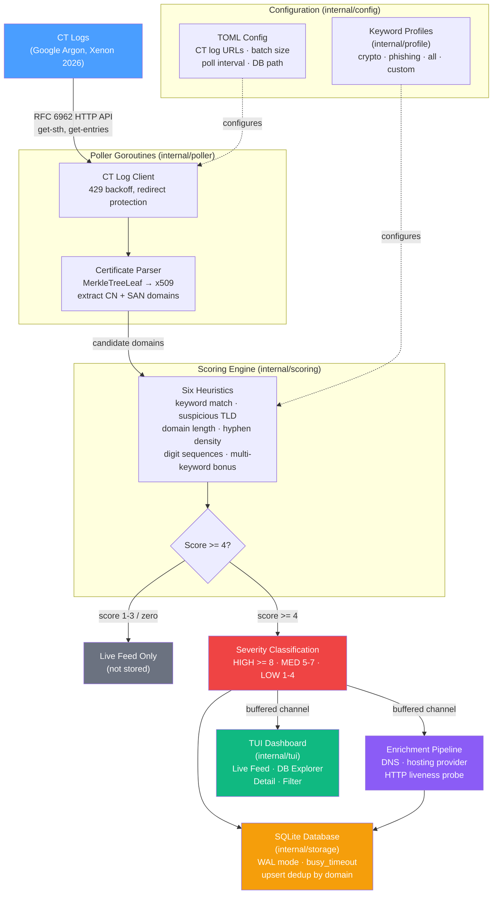

# ctsnare

[](https://github.com/ul0gic/ctsnare/actions/workflows/ci.yml)
[](https://go.dev/)
[](LICENSE)
[](https://github.com/ul0gic/ctsnare/releases)
[](https://goreportcard.com/report/github.com/ul0gic/ctsnare)

Monitor Certificate Transparency logs in real-time to detect phishing, typosquatting, and brand impersonation domains the moment their TLS certificates are issued.

ctsnare polls public CT logs directly (RFC 6962 API, no third-party relay), scores new domains against keyword profiles using six heuristics, enriches hits with DNS and HTTP liveness probes, stores actionable hits in an embedded SQLite database, and gives you a live terminal dashboard plus a composable CLI query interface — all in a single, zero-dependency binary.

- **Real-time CT log polling** — direct RFC 6962 polling of Google Argon and Xenon logs. No relays, no accounts, no API keys.
- **Scoring engine** — six heuristics with severity classification; only actionable hits reach the database.
- **Domain tracker** — `--domain` mode stores every cert issued for an apex you care about and all its subdomains.
- **Enrichment** — automatic DNS resolution, hosting provider detection, and HTTP liveness probes per hit.
- **TUI + CLI** — live dashboard with DB explorer, plus composable `query` filters for scripting and piping.
- **Single binary** — pure-Go SQLite, no runtime, no setup.

---

## Quick Start

```bash
go install github.com/ul0gic/ctsnare/cmd/ctsnare@latest

ctsnare watch
```

This opens the TUI dashboard, polls Google Argon and Xenon 2026 CT logs against the `all` profile (crypto + phishing keywords), and stores hits scoring 4+ in `~/.local/share/ctsnare/ctsnare.db`. Press `Tab` to switch between Live Feed and DB Explorer, `p` to pause the feed, `?`-style hints are in each view, `q` to quit.

```bash
# Headless (server / cron) — polls and stores until SIGINT/SIGTERM
ctsnare watch --headless

# Start 5000 entries behind the log tip for immediate results
ctsnare watch --backtrack 5000

# Track a brand: store EVERY cert for the apex + all subdomains
ctsnare watch --domain openai.com --session openai

# Query what you've collected
ctsnare query --severity HIGH --since 24h --format json | jq '.domain'
```

Pre-built binaries for Linux, macOS, and Windows are on the [Releases](https://github.com/ul0gic/ctsnare/releases) page; or build from source with Go 1.26+ (`go build -o ctsnare ./cmd/ctsnare`).

---

## Architecture


```mermaid
flowchart TD
    A["CT Logs\n(Google Argon, Xenon 2026)"] -->|"RFC 6962 HTTP API\nget-sth, get-entries"| B

    subgraph Polling ["Poller Goroutines (internal/poller)"]
        B["CT Log Client\n429 backoff, redirect protection"] --> C["Certificate Parser\nMerkleTreeLeaf → x509\nextract CN + SAN domains"]
    end

    C -->|"candidate domains"| D

    subgraph Scoring ["Scoring Engine (internal/scoring)"]
        D["Six Heuristics\nkeyword match · suspicious TLD\ndomain length · hyphen density\ndigit sequences · multi-keyword bonus"] --> E{"Score >= 4?"}
    end

    E -->|"score 1-3 / zero"| F["Live Feed Only\n(not stored)"]
    E -->|"score >= 4"| G["Severity Classification\nHIGH >= 8 · MED 5-7 · LOW 1-4"]

    G --> H["SQLite Database\n(internal/storage)\nWAL mode · busy_timeout\nupsert dedup by domain"]
    G -->|"buffered channel"| I["Enrichment Pipeline\nDNS · hosting provider\nHTTP liveness probe"]
    G -->|"buffered channel"| J["TUI Dashboard\n(internal/tui)\nLive Feed · DB Explorer\nDetail · Filter"]
    I --> H

    subgraph Config ["Configuration (internal/config)"]
        K["TOML Config\nCT log URLs · batch size\npoll interval · DB path"] -.->|"configures"| B
        L["Keyword Profiles\n(internal/profile)\ncrypto · phishing · all · custom"] -.->|"configures"| D
    end

    style A fill:#4a9eff,color:#fff
    style H fill:#f59e0b,color:#fff
    style J fill:#10b981,color:#fff
    style I fill:#8b5cf6,color:#fff
    style F fill:#6b7280,color:#fff
    style G fill:#ef4444,color:#fff
```

**Key design decisions:**

- **Decoupled polling and display.** Pollers push scored hits through buffered channels; the TUI subscribes and never blocks polling.
- **Score-based storage.** Only hits scoring 4+ persist (tunable with `--min-score`); the live feed shows everything for situational awareness.
- **Background enrichment.** A rate-limited worker pool (5 workers) probes each stored domain for DNS, hosting provider, and HTTP liveness.
- **Pure Go SQLite** (`modernc.org/sqlite`) in WAL mode with a busy timeout — crash-safe, concurrent readers and writers, no CGo, no system libraries.
- **Upsert deduplication.** The same domain across multiple certs updates in place; uniqueness enforced at the database level.
- **Config cascade.** Defaults → TOML config → CLI flags. Zero configuration required.

```
ctsnare/
├── cmd/ctsnare/         Entry point
├── internal/
│   ├── domain/          Shared types and interfaces (Hit, Scorer, Store, Profile)
│   ├── domainutil/      Apex/subdomain matching utilities
│   ├── config/          TOML config loading, skip suffix management
│   ├── profile/         Keyword profiles (built-in + custom)
│   ├── scoring/         Domain scoring heuristics
│   ├── storage/         SQLite data layer (upsert, query, export)
│   ├── poller/          CT log HTTP client and polling goroutines
│   ├── enrichment/      DNS resolution, hosting detection, HTTP liveness
│   ├── tui/             Bubble Tea TUI (feed, explorer, detail, filter)
│   └── cmd/             Cobra subcommand definitions
```

---

## Commands

Every command has full flag documentation and examples via `--help`.

| Command | What it does |
|---------|--------------|
| `ctsnare watch` | Live CT monitoring — TUI by default, `--headless` for servers |
| `ctsnare query` | Search stored hits with composable filters; table/JSON/CSV output |
| `ctsnare db stats` / `clear` / `export` / `path` | Database management (`clear` requires `--confirm`, supports `--session`) |
| `ctsnare profiles` / `profiles show <name>` | List and inspect keyword profiles |
| `ctsnare skip list` / `add` / `remove` / `reset` | Manage the infrastructure noise skip list |

### Watching

```bash
ctsnare watch --profile crypto --session morning-run
ctsnare watch --headless --poll-interval 10s --batch-size 1024
ctsnare watch --backtrack 5000
```

`--backtrack` counts log **entries, not time** — busy CT logs ingest millions of entries per day, so backtrack catches *recent* issuance at startup, not deep history. For a domain's full certificate history use [crt.sh](https://crt.sh).

### Domain-tracker mode

Pass one or more `--domain` flags to store **every** newly issued certificate for an apex and all its subdomains — unconditionally, regardless of score or profile:

```bash
ctsnare watch --domain openai.com --domain anthropic.com --session brands
```

Matching is exact: `--domain openai.com` matches `openai.com` and `api.openai.com` but **not** `notopenai.com` or `openai.com.evil.com`. Use keyword profiles for lookalike detection; use `--domain` for domains you actually own or care about precisely. Tracked rows are tagged with profile `domain-track`; pair with `--session` for later filtering.

### Querying

```bash
ctsnare query --severity HIGH
ctsnare query --keyword login --tld .xyz --since 6h
ctsnare query --live-only --min-score 5 --format json
ctsnare query --domain openai.com --session openai
ctsnare query --session midnight-run --format csv > midnight-run.csv
```

Filters compose with AND. `--since` accepts Go durations plus a day suffix (`12h`, `7d`).

### TUI keys

Feed: `Tab` switch view · `p` pause · `j/k` scroll · `q` quit.
Explorer: `Enter` drill in · `f` filter · `s` sort · `b` bookmark · `Space/a/A` select · `d/D` delete · `C` clear DB · `r` reload · `Esc` back.

---

## Scoring

Every domain extracted from a certificate is scored independently; the total maps to a severity.

| Heuristic | Points | Condition |
|-----------|--------|-----------|
| Keyword match | +2 per keyword | Domain contains a profile keyword (case-insensitive substring) |
| Suspicious TLD | +1 | TLD is in the profile's TLD list |
| Domain length | +1 | Registered domain exceeds 30 characters |
| Hyphen density | +1 | 2 or more hyphens |
| Digit sequence | +1 | 4 or more consecutive digits |
| Multi-keyword bonus | +2 | 3 or more keywords matched |

Severity: **HIGH** ≥ 8 · **MED** 5–7 · **LOW** 1–4. By default hits scoring 4+ are stored; 1–3 appear in the live feed only; 0 is discarded. Tune with `--min-score`.

**Profiles.** Built-ins: `crypto` (45 keywords — exchanges, wallets, casinos), `phishing` (41 keywords — brands, credential bait), and `all` (both combined). Inspect any profile with `ctsnare profiles show <name>`, or define your own in TOML (see Configuration).

**Noise filtering.** Domains ending with known infrastructure suffixes (52 built-in globals — cloud providers, CDNs, PaaS, big tech) skip scoring entirely. Manage with `ctsnare skip list/add/remove/reset`; effective list = globals + your additions − your removals.

**Enrichment.** Every stored hit gets DNS resolution, CIDR-based hosting provider detection, and an HTTP HEAD liveness probe in the background. Results show in the detail view and filter with `--live-only`.

---

## Configuration

ctsnare runs with zero configuration. Optional TOML config at `~/.config/ctsnare/config.toml` (or `--config`); precedence is defaults < config file < CLI flags.

```toml
[[ct_logs]]
url  = "https://ct.googleapis.com/logs/us1/argon2026h1"
name = "Google Argon 2026h1"

default_profile = "all"   # profile when --profile is not set
batch_size      = 256     # entries fetched per poll per log
poll_interval   = "5s"    # wait between polls per log
backtrack       = 0       # start N entries behind the log tip
# db_path = "/home/user/.local/share/ctsnare/ctsnare.db"  # default: XDG path

[skip_overrides]          # managed via `ctsnare skip add/remove/reset`
additions = ["sailpoint.com"]
removals  = []

# Custom profile — or extend a built-in with description = "extends:crypto"
[custom_profiles.brand]
name            = "brand"
description     = "Brand protection monitoring for Acme Corp"
keywords        = ["acme", "acmecorp", "acme-bank", "acmepay"]
suspicious_tlds = [".xyz", ".top", ".vip", ".click"]
```

```bash
ctsnare watch --profile brand
```

---

## Development

Requires Go 1.26+ and [golangci-lint](https://golangci-lint.run/usage/install/).

```bash
git clone https://github.com/ul0gic/ctsnare.git
cd ctsnare
make check    # build + vet + lint + test (race detection)
```

Other targets: `make build`, `make test`, `make lint`, `make fmt`, `make coverage`, `make clean`.

---

## License

MIT License. See [LICENSE](LICENSE) for details.
